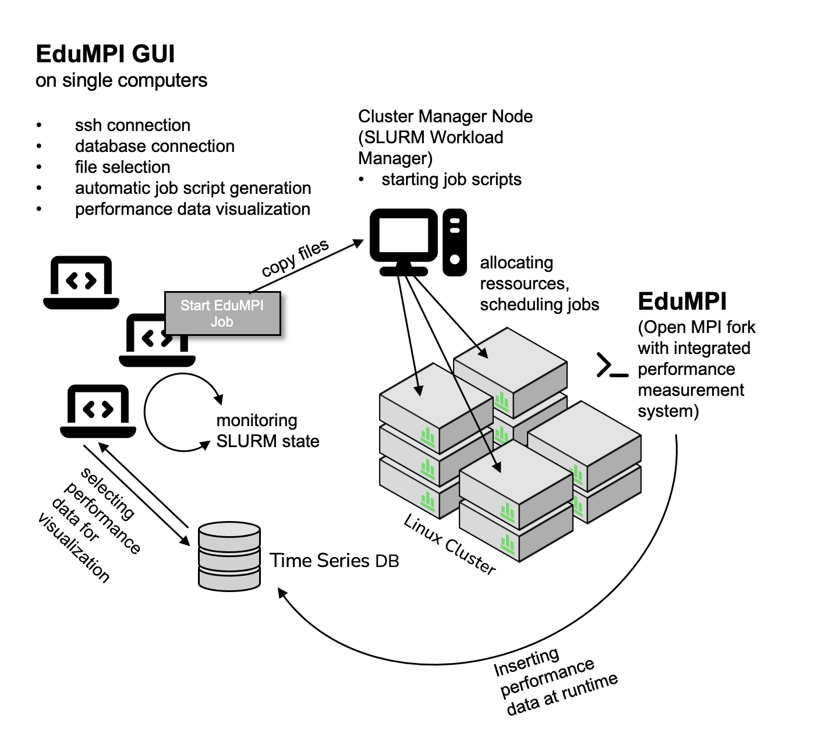
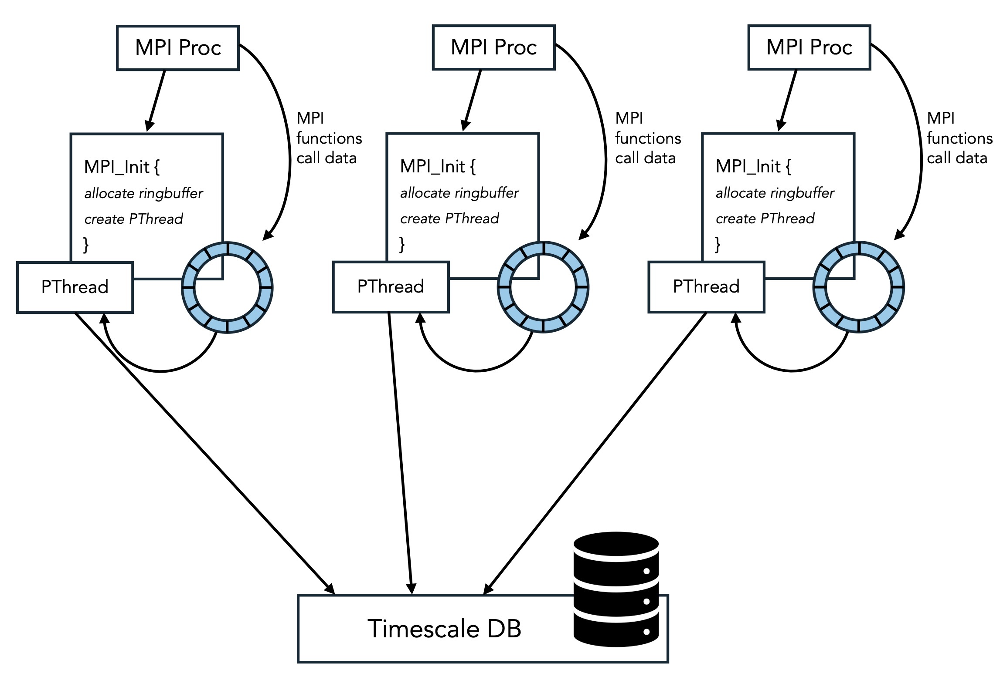
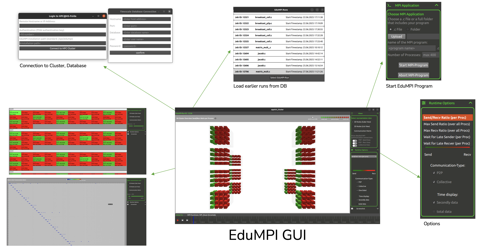

# EduMPI – Open MPI Fork for Near-Real-Time MPI Performance Monitoring

**EduMPI** is a fork of [Open MPI](https://www.open-mpi.org/) designed for **education** and **parallel performance analysis**.  
It enables near-real-time monitoring of MPI programs by combining efficient **in-process logging**, a **ring buffer**, and **binary data insertion into PostgreSQL/TimescaleDB**.  
This approach makes MPI communication patterns visible to students and researchers with minimal overhead (<4%).

This is the EduMPI Repository. [Here](https://github.com/AnnaLena77/EduMPI_GUI) you can find the EduMPI GUI Repository including Frontend-Code.

---

## ✨ Key Features

- **Open MPI Fork with Instrumentation**
  - Extended internals capture **all MPI function calls**, including details of collective algorithms (e.g., point-to-point in `MPI_Bcast`)
  - Tracks wait states (sender waiting for receiver, etc.)
  - Fully automated – no code instrumentation required

- **Low-Overhead Measurement**
  - Each MPI process initializes a **ring buffer** and a dedicated **POSIX thread**
  - MPI function events are stored in memory and asynchronously flushed to the database
  - Overhead remains <4% even for communication-heavy applications

- **Optimized Data Ingestion**
  - Specialized C parser for **PostgreSQL Binary COPY**
  - Direct binary data transfer avoids costly string conversions (CSV/TEXT)
  - Parallel insertions from all processes supported

- **Time-Series Data Management**
  - Built on **TimescaleDB (PostgreSQL)**  
  - Continuous aggregation policies provide **per-second summaries**
  - Materialized views enable efficient querying & visualization

- **Near-Real-Time Visualization**
  - Delay of only ~3s for live updates
  - Timeline navigation: per-second, interval-based, or whole execution
  - Supports multiple visualizations (2D, 3D, communication matrices)

---

## ⚙️ Architecture

EduMPI extends Open MPI with a **logging framework** integrated at `MPI_Init`:

1. **MPI_Init**
   - Initializes **ring buffer** and **PThread**
2. **During Execution**
   - Main thread logs MPI events (timestamps, message sizes, algorithms) into the buffer
3. **Data Transfer**
   - PThread flushes buffer entries via **Binary COPY** into PostgreSQL
4. **Aggregation**
   - TimescaleDB performs continuous per-second aggregation
5. **Visualization**
   - GUI retrieves aggregated data and renders real-time communication patterns

---

## 🖥️ Screenshots

  

---

## 📊 Performance & Overhead

EduMPI was benchmarked with **NAS Parallel Benchmarks** and **row-wise matrix multiplication**:

- Overhead remains **<4%**
- Scales up to hundreds of processes (tested with 400 MPI processes on a non-hyperthreaded cluster)
- Reliable under both light and communication-intensive workloads
- Known limitation: ring buffer size must be tuned to avoid overflow in extreme high-frequency cases (e.g., ping-pong tests)

---

## 🚀 Installation

### Cluster Side
1. Build EduMPI (fork of Open MPI)  

### Database (same network as the cluster)
1. Install and configure **TimescaleDB** (PostgreSQL)  
2. Enable **Binary COPY ingestion**  
3. Create tables, materialized views 

### Client Side
1. Download [EduMPI GUI (AppImage)](https://github.com/AnnaLena77/EduMPI_GUI_Download) or build your own instance with QT, cloning the [EduMPI GUI Repo](https://github.com/AnnaLena77/EduMPI_GUI) (recommended for individual university access)
2. Connect to cluster with login credentials  
3. Run and visualize MPI applications in real-time  

---

## 📚 References

EduMPI is described in:

- Roth, Anna-Lena; Süß, Tim (2023): *Performance Analysis Tools for MPI Applications and their Use in Programming Education*. In Companion of the 2023 ACM/SPEC International Conference on Performance Engineering (ICPE '23 Companion). Association for Computing Machinery, New York, NY, USA, 361–368. 
DOI: [10.1145/3578245.3584358](https://doi.org/10.1145/3578245.3584358) 
- Roth, Anna-Lena; James, David; Kuhn, Michael; Konert, Johannes (2024): *Enhancing Parallel Programming Education with High-Performance Clusters Utilizing Performance Analysis*. Proceedings of DELFI 2024. DOI: 10.18420/delfi2024_42. Gesellschaft für Informatik e.V. 
DOI: [10.18420/delfi2024_42](https://doi.org/10.18420/delfi2024_42)
- Roth, Anna-Lena; James, David; Kuhn, Michael (2025): *EduMPI – Simplifying the Use of High-Performance Clusters and Focusing Performance Analysis in Parallel Programming Education*. PARS-Mitteilungen: Vol. 37. Gesellschaft für Informatik e.V., Fachgruppe PARS. ISSN: 0177-0454[LINK](https://dl.gi.de/server/api/core/bitstreams/5ee764b8-731a-4b8e-aca4-28cb0538fd7b/content)
- Roth, Anna-Lena; James, David; Kuhn, Michael; Frisch, Dustin (2025): *Making MPI Collective Operations Visible: Understanding Their Utility and Algorithmic insights*. In: Nagel, W.E., Goehringer, D., Diniz, P.C. (eds) Euro-Par 2025: Parallel Processing. Euro-Par 2025. Lecture Notes in Computer Science, vol 15900. Springer, Cham. 
DOI: [10.1007/978-3-031-99854-6_5](https://doi.org/10.1007/978-3-031-99854-6_5)

---

## 🔮 Future Work

- Improve ring buffer adaptivity to avoid overflow in micro-benchmarks  
- Extend support for additional MPI language bindings beyond C  
- Portable integration as an **independent framework** instead of Open MPI fork  
- Additional visualization dashboards (historical runs, anomaly detection)  

---

